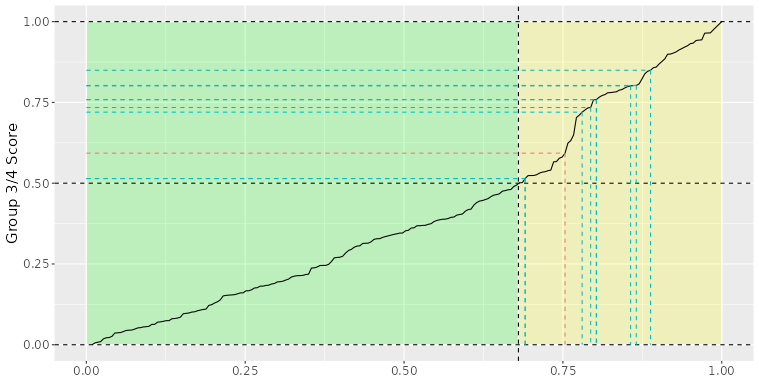
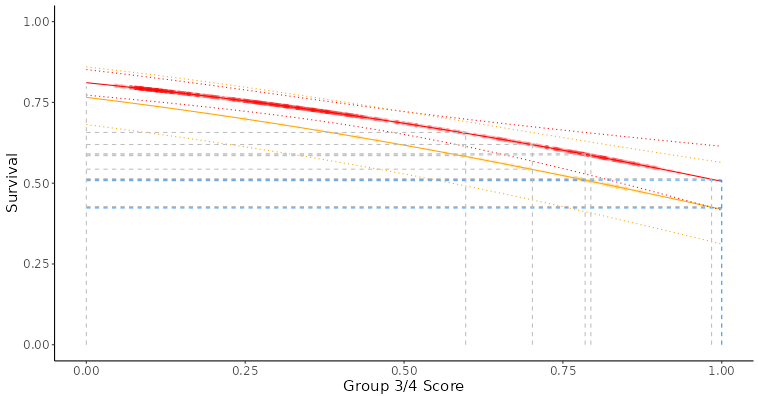
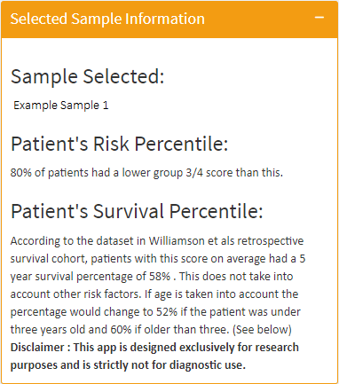
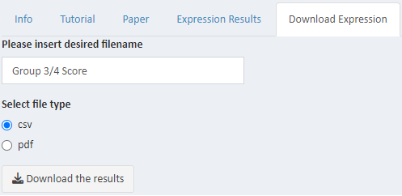

# Tutorial
## Step One - Select Expression or Methylation and Upload Data

Depending on whether you are uploading Expression or Methylation data select the appropriate option.

Upload your idat files (for now unzipped idat files only) including both red and green files for Methylation, or RDS/TXT/CSV files for Expression.

Increasing the number of samples will of course increase the length of time for the upcoming processes so we recommend ~10 sample batches. This will make looking through the results easier and will speed up the process.

If uploading Expression data you will be asked to give up to two further inputs:  
1. Selecting whether to scale your results against Williamson et. al's data frame or against your own uploaded data.
2.  If you selected scaling against your own data you will be asked if you want to filter out any outliers. This is done via a sliding scale from zero for no removal to five, for removing 5x standard deviations from the higher and lower results.

## Step Two - Generate Group 3-4 Scores

Click the "Generate Group 3/4 Score" button. This will start the process of generating Group 3/4 Continuum Scores and a loading bar should begin filling underneath the "Reset" button.

## Step Three - Results

Once the calculation has been completed you should be brought to the Results tab. This tab will show a data table at the top which displays your sample names on the left and their Group 3/4 Scores on the right.

It will also show a number of graphs, an example is below.

### Group 3/4 Plot
Places your sample data on a cumulative frequency plot based on data from Williamson et als Cell Reports paper. It tells you whether the patient is Group 3 or Group 4 and allows you to see where the patient ranks against our large dataset.

### Survival Plot: No Risk Factors Considered
Shows patients expected five year survival based on only their group 3/4 score and no other risk factors.

### Survival Plot: Age Considered
Shows patients expected five year survival based on their group 3/4 score but also taking into account their age.

There will also be a box entitled "Selected Sample Information", this will inform you of the currently selected sample (which will also be highlighted on the graphs), and give some information about the sample and the expected survival.

## Step Four - Export Data

Once you have your results you can download your data as a CSV file (data table results), or as a PDF (data table and graphs).

## Step Five - Reset

Once you have looked over or downloaded your data you can reset the app to upload other samples. 

To do this click the "Reset" button in the bar on the left of the app.

